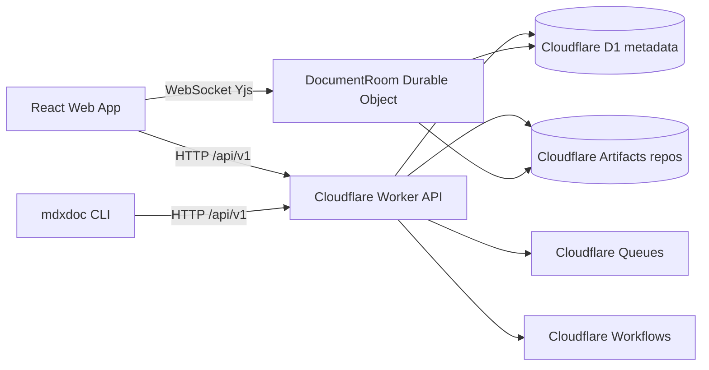
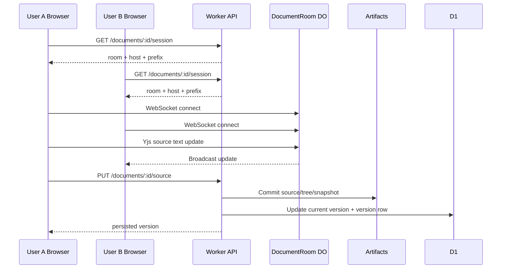
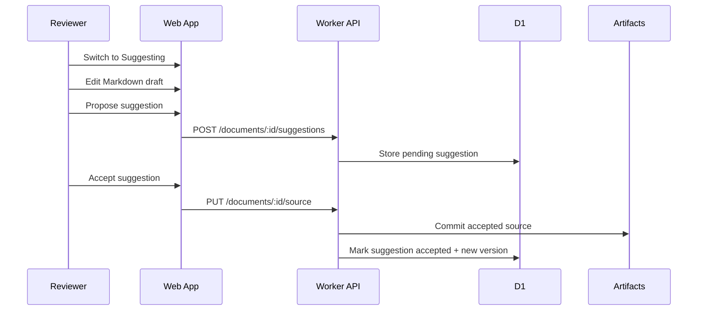

# mdxdoc

A collaborative Markdown/MDX document editor built on Cloudflare. mdxdoc aims to combine a Google Docs-style collaboration model with portable Markdown/MDX source, API-first operations, and a CLI for power users and agents.

Current app: a working MVP with dashboard, raw Markdown editing, preview, real-time collaborative draft sync, comments, suggestions, versions/checkpoints, changesets, API, SDK, and CLI.

## Live deployments

- Web: https://mdxdoc-web.pages.dev
- Latest preview used during development: https://e2256088.mdxdoc-web.pages.dev
- API: https://mdxdoc-api.agents-b8a.workers.dev

## What works today

- Dashboard with existing documents
- Create, rename, delete, select/deselect, and bulk-remove documents
- Share links via `?doc=<documentId>`
- Raw Markdown/MDX editor by default
- Quick preview surface
- Real-time typing sync between collaborators in Editing mode
- Suggesting mode for reviewable source-level suggestions
- Accept/reject suggestions
- General comments and selected-source comments
- Resolve comments
- Versions tab with checkpoint/restore support
- Changesets tab with create/accept/reject metadata flow
- Command palette via `Cmd/Ctrl+K`
- Public SDK used by web and CLI
- OpenAPI contract
- Playwright E2E tests for core MVP flows

## Architecture



### Storage model

The app uses **Cloudflare Artifacts**, not R2, for document source/tree/snapshot version artifacts.

One artifact repo per document:

```txt
mdxdoc-{workspaceId}-{documentId}
```

Version layout:

```txt
versions/000001/source.mdx
versions/000001/tree.json
versions/000001/snapshot.yjs.bin
versions/000001/manifest.json
```

Metadata lives in D1:

- workspaces
- documents
- permissions
- comments
- suggestions
- changesets
- versions

## Collaboration flow



## Suggestion flow



## Monorepo layout

```txt
apps/
  api/      Cloudflare Worker API, Durable Objects, repositories, tests
  web/      React app, shadcn-style UI primitives, editor surfaces
  cli/      mdxdoc CLI backed by the public SDK
packages/
  document-model/  document/domain types and helpers
  mdx/             Markdown/MDX parse/serialize pipeline
  protocol/        shared protocol/API types
  sdk-js/          public JavaScript SDK
  ui/              shared UI package scaffold
docs/
  API_CLI_PARITY.md
  IMPLEMENTATION_PLAN.md
  RUNBOOK.md
openapi/
  openapi.yaml
migrations/
  0001_initial.sql
```

## Requirements

- Node.js 20+
- pnpm 10+
- Wrangler / Cloudflare account for deployment
- GitHub CLI optional for repo management

## Install

```bash
pnpm install
```

## Local development

Run web locally against deployed API:

```bash
cd apps/web
VITE_API_URL=https://mdxdoc-api.agents-b8a.workers.dev \
VITE_COLLAB_HOST=mdxdoc-api.agents-b8a.workers.dev \
pnpm exec vite --host 127.0.0.1 --port 5173
```

Run API locally:

```bash
pnpm --filter @mdxdoc/api dev
```

## Tests

Unit/integration tests:

```bash
pnpm test
```

Typecheck:

```bash
pnpm typecheck
```

Playwright against deployed or configured URL:

```bash
PLAYWRIGHT_BASE_URL=https://mdxdoc-web.pages.dev pnpm test:e2e
```

Playwright local web against deployed API:

```bash
pnpm test:e2e:local
```

Live CLI smoke against deployed API:

```bash
MDXDOC_CLI_SMOKE_API_URL=https://mdxdoc-api.agents-b8a.workers.dev \
  pnpm vitest run apps/cli/test/cli-live.test.ts
```

Current expected result:

```txt
Vitest: all passing
Playwright local/deployed: all passing
CLI live smoke: passing when env var is set
```

## CLI examples

```bash
# List workspaces
pnpm exec tsx apps/cli/src/index.ts --api-url https://mdxdoc-api.agents-b8a.workers.dev workspaces

# Create a document
pnpm exec tsx apps/cli/src/index.ts --api-url https://mdxdoc-api.agents-b8a.workers.dev \
  docs create "Launch Plan" --workspace <workspaceId>

# Pull source
pnpm exec tsx apps/cli/src/index.ts --api-url https://mdxdoc-api.agents-b8a.workers.dev \
  pull <documentId> --out doc.mdx

# Safe push: creates a suggestion by default
pnpm exec tsx apps/cli/src/index.ts --api-url https://mdxdoc-api.agents-b8a.workers.dev \
  push <documentId> doc.mdx

# Direct apply
pnpm exec tsx apps/cli/src/index.ts --api-url https://mdxdoc-api.agents-b8a.workers.dev \
  push <documentId> doc.mdx --apply

# Comments
pnpm exec tsx apps/cli/src/index.ts --api-url https://mdxdoc-api.agents-b8a.workers.dev comments <documentId>
pnpm exec tsx apps/cli/src/index.ts --api-url https://mdxdoc-api.agents-b8a.workers.dev comment add <documentId> --message "Clarify this" --quote "important text"

# Suggestions
pnpm exec tsx apps/cli/src/index.ts --api-url https://mdxdoc-api.agents-b8a.workers.dev suggestions <documentId>
pnpm exec tsx apps/cli/src/index.ts --api-url https://mdxdoc-api.agents-b8a.workers.dev suggestion accept <suggestionId>

# Versions
pnpm exec tsx apps/cli/src/index.ts --api-url https://mdxdoc-api.agents-b8a.workers.dev versions <documentId>
pnpm exec tsx apps/cli/src/index.ts --api-url https://mdxdoc-api.agents-b8a.workers.dev checkpoint <documentId>
pnpm exec tsx apps/cli/src/index.ts --api-url https://mdxdoc-api.agents-b8a.workers.dev restore <documentId> <versionId>
```

## API contract

OpenAPI lives at:

```txt
openapi/openapi.yaml
```

Parity audit:

```txt
docs/API_CLI_PARITY.md
```

The guiding rule:

> If the user can do it in the UI, an agent or CLI should be able to do it through the public API.

## Deployment

API deploy:

```bash
cd apps/api
pnpm exec wrangler deploy
```

Web build/deploy:

```bash
VITE_API_URL=https://mdxdoc-api.agents-b8a.workers.dev \
VITE_COLLAB_HOST=mdxdoc-api.agents-b8a.workers.dev \
pnpm --filter @mdxdoc/web build

cd apps/web
CLOUDFLARE_ACCOUNT_ID=<account-id> \
pnpm exec wrangler pages deploy dist --project-name mdxdoc-web --branch main
```

## Current limitations

- WYSIWYG/TipTap visual editor is not active in the current UI; raw Markdown is the primary editor.
- Changeset accept/reject is metadata-only; applying grouped suggestions belongs to Phase 4.
- Preview is a safe Markdown-ish render, not full production MDX component rendering.
- Auth is local/prototype-grade; real sharing and roles need hardening.
- Comment anchoring supports selected source ranges, but robust reattachment/orphaning is a later phase.

## Roadmap

1. Phase 4: real granular suggestions, diffs, changeset application/conflict handling
2. Phase 5: robust comment anchors, reattachment, orphan states
3. Phase 6: WYSIWYG returns with TipTap, component cards, prop inspector
4. Phase 7: richer version history UI and restore workflows
